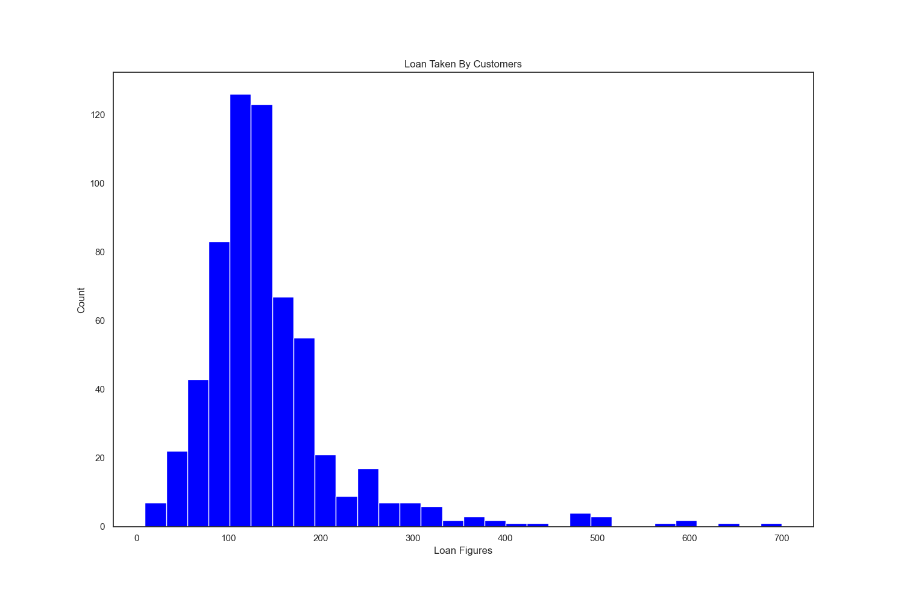

# Project Loan_Approval

# Table of contents
* [Introduction](#Introduction)
* [Technologies](#Technologies)
* [Predicting Loan Approval](#Predicting-Loan-Approval)
* [Data Sources](#Data-Sources)
* [Development Team](#Development-Team)

## Introduction
This is a classification problem where I have to predict whether a loan will be approved or not. Specifically, it is a binary classification problem where I have to predict either one of the two classes given i.e approved (Y) and not approved (N). 

## Technologies 
1. Python
2. HTML & CSS
3. Pandas
4. Tableau 
5. Machine Learning

## Preducting Loan Approval
Machine Learning project to predict whether or not loan application will be approved or not. Three machine learing algorithms are available. code used in Python3. 
   1. Logistic regression (0.832)
   2. Decision Tree (0.76)
   3. Random Forset (0.8)
## Data Sources
   ### https://www.kaggle.com/granjithkumar/loan-approval-data-set

# Development By 
1. [Github](https://github.com/seidiali21)
2. [Linkedin](https://www.linkedin.com/in/seidi-ali-mohammad/)

